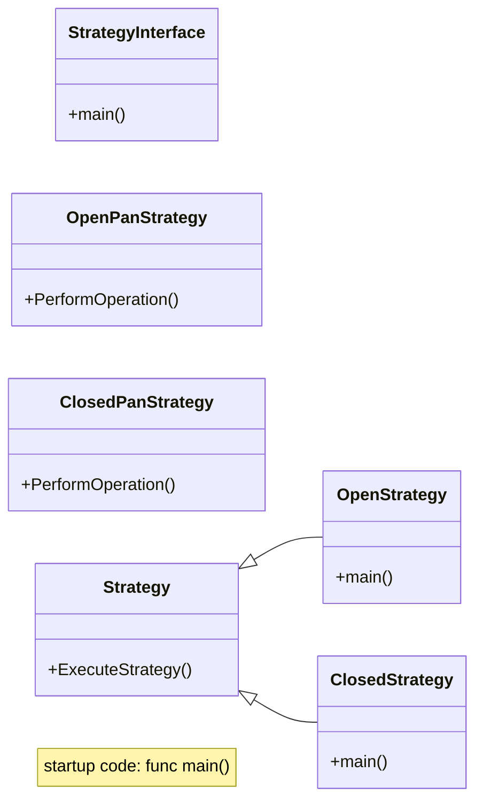

```mermaid
classDiagram
  direction LR
  class StrategyInterface {
    +main()
  }

  class OpenPanStrategy {
    +PerformOperation()
  }

  class ClosedPanStrategy {
    +PerformOperation()
  }

  class Strategy {
    +ExecuteStrategy()
  }

  class OpenStrategy {
    +main()
  }

  class ClosedStrategy {
    +main()
  }

  Strategy <|-- OpenStrategy
  Strategy <|-- ClosedStrategy
  note "startup code: func main()"
```
