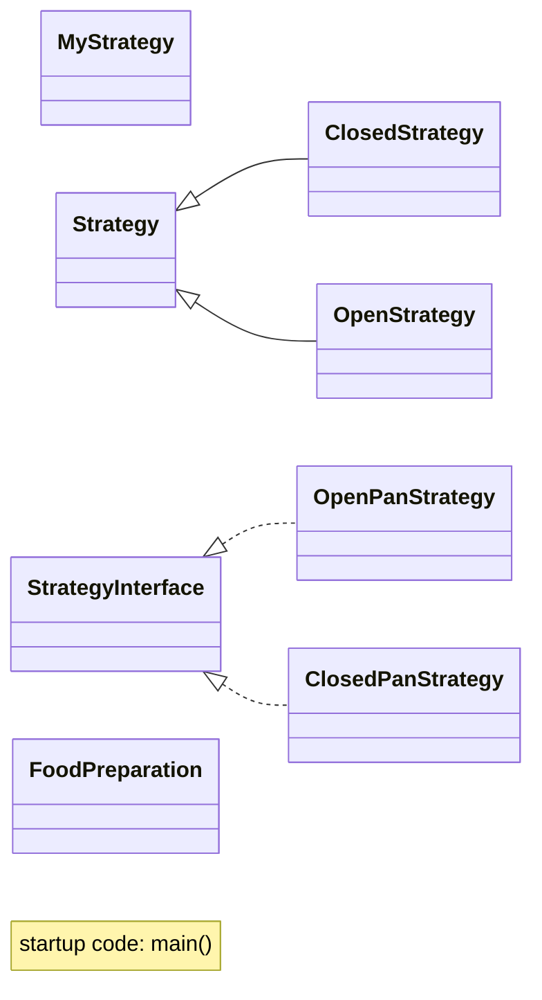

```mermaid
classDiagram
  direction LR
  class MyStrategy {
  }

  class Strategy {
  }

  class StrategyInterface {
  }

  class ClosedStrategy {
  }

  class OpenPanStrategy {
  }

  class FoodPreparation {
  }

  class OpenStrategy {
  }

  class ClosedPanStrategy {
  }

  Strategy <|-- ClosedStrategy
  StrategyInterface <|.. OpenPanStrategy
  Strategy <|-- OpenStrategy
  StrategyInterface <|.. ClosedPanStrategy
  note "startup code: main()"
```
