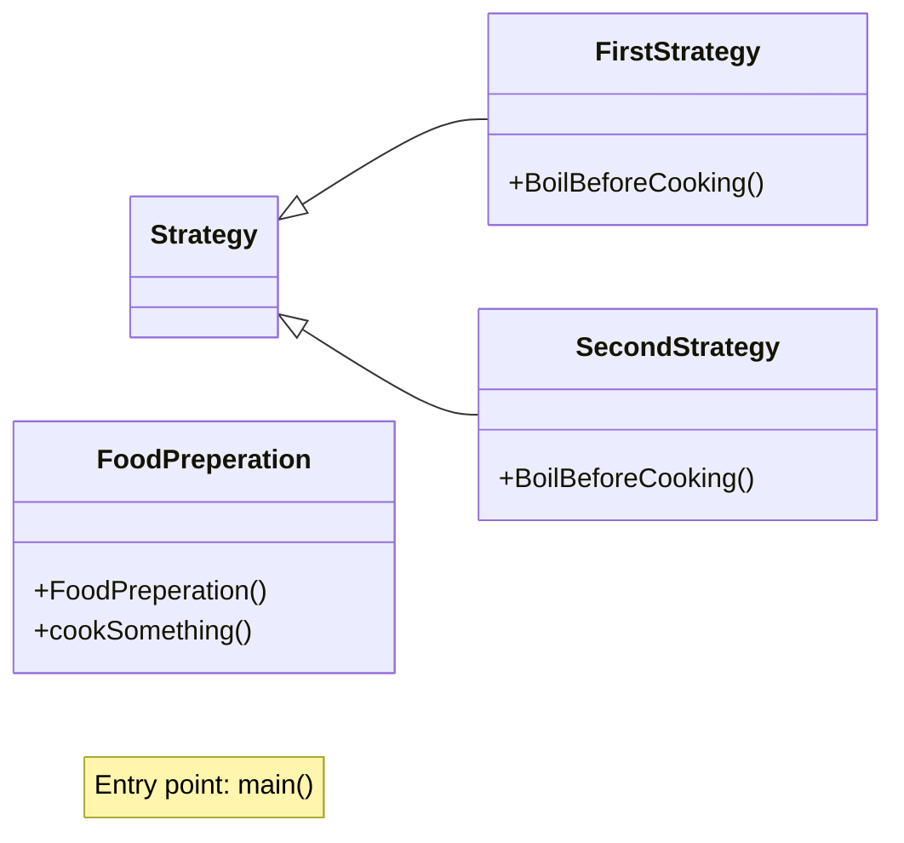

```mermaid
classDiagram
  direction LR

  class Strategy

  class FoodPreperation {
    +FoodPreperation()
    +cookSomething()
  }

  class FirstStrategy {
    +BoilBeforeCooking()
  }

  class SecondStrategy {
    +BoilBeforeCooking()
  }

  Strategy <|-- FirstStrategy

  Strategy <|-- SecondStrategy

  note "Entry point: main()"
```
