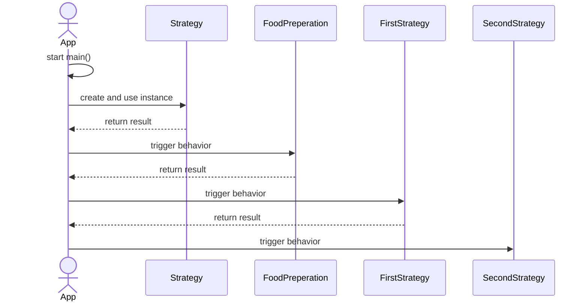

```mermaid
sequenceDiagram
  actor App
  participant Strategy
  participant FoodPreperation
  participant FirstStrategy
  participant SecondStrategy
  App->>App: start main()
  App->>Strategy: create and use instance
  Strategy-->>App: return result
  App->>FoodPreperation: trigger behavior
  FoodPreperation-->>App: return result
  App->>FirstStrategy: trigger behavior
  FirstStrategy-->>App: return result
  App->>SecondStrategy: trigger behavior
```
