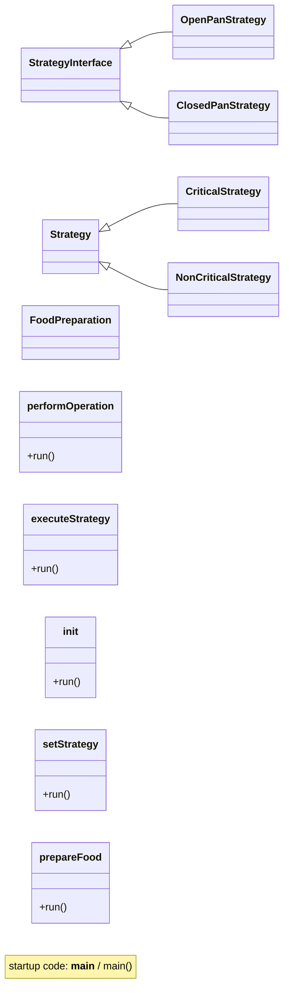

```mermaid
classDiagram
  direction LR
  class StrategyInterface {
  }
  class OpenPanStrategy {
  }
  class ClosedPanStrategy {
  }
  class Strategy {
  }
  class CriticalStrategy {
  }
  class NonCriticalStrategy {
  }
  class FoodPreparation {
  }
  class performOperation {
    +run()
  }
  class executeStrategy {
    +run()
  }
  class __init__ {
    +run()
  }
  class setStrategy {
    +run()
  }
  class prepareFood {
    +run()
  }
  StrategyInterface <|-- OpenPanStrategy
  StrategyInterface <|-- ClosedPanStrategy
  Strategy <|-- CriticalStrategy
  Strategy <|-- NonCriticalStrategy
  note "startup code: __main__ / main()"
```
