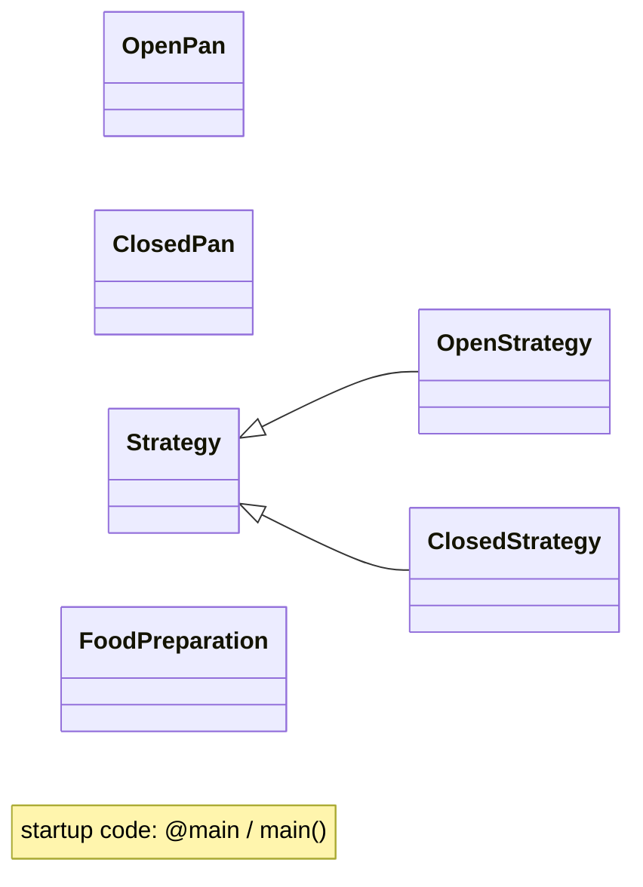

```mermaid
classDiagram
  direction LR
  class OpenPan {
  }
  class ClosedPan {
  }
  class Strategy {
  }
  class OpenStrategy {
  }
  class ClosedStrategy {
  }
  class FoodPreparation {
  }
  Strategy <|-- OpenStrategy
  Strategy <|-- ClosedStrategy
  note "startup code: @main / main()"
```
