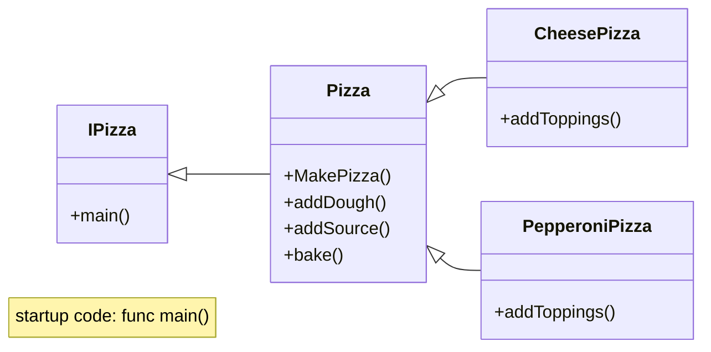

```mermaid
classDiagram
  direction LR
  class CheesePizza {
    +addToppings()
  }

  class IPizza {
    +main()
  }

  class Pizza {
    +MakePizza()
    +addDough()
    +addSource()
    +bake()
  }

  class PepperoniPizza {
    +addToppings()
  }

  Pizza <|-- CheesePizza
  IPizza <|-- Pizza
  Pizza <|-- PepperoniPizza
  note "startup code: func main()"
```
