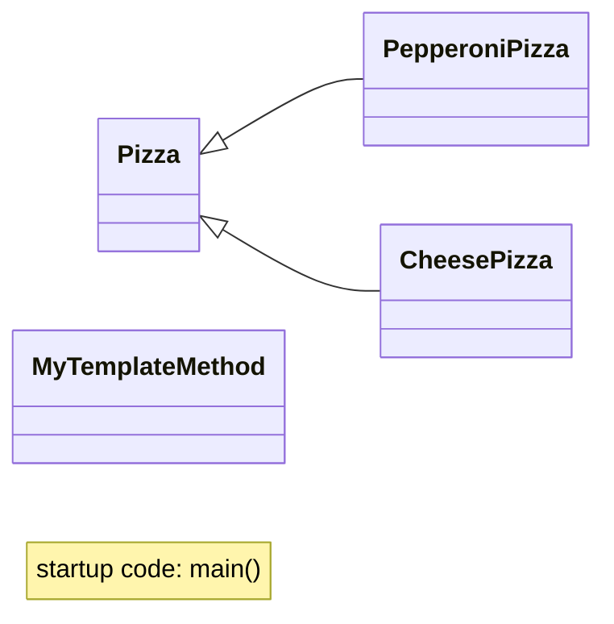

```mermaid
classDiagram
  direction LR
  class PepperoniPizza {
  }

  class Pizza {
  }

  class MyTemplateMethod {
  }

  class CheesePizza {
  }

  Pizza <|-- PepperoniPizza
  Pizza <|-- CheesePizza
  note "startup code: main()"
```
