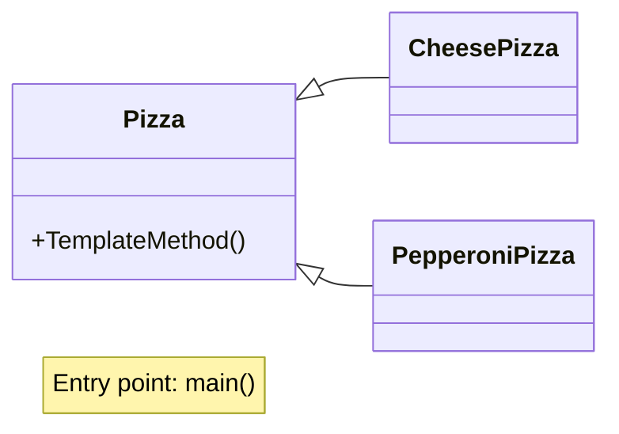

```mermaid
classDiagram
  direction LR

  class Pizza {
    +TemplateMethod()
  }

  class CheesePizza

  class PepperoniPizza

  Pizza <|-- CheesePizza

  Pizza <|-- PepperoniPizza

  note "Entry point: main()"
```
