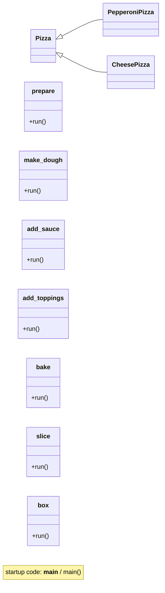

```mermaid
classDiagram
  direction LR
  class Pizza {
  }
  class PepperoniPizza {
  }
  class CheesePizza {
  }
  class prepare {
    +run()
  }
  class make_dough {
    +run()
  }
  class add_sauce {
    +run()
  }
  class add_toppings {
    +run()
  }
  class bake {
    +run()
  }
  class slice {
    +run()
  }
  class box {
    +run()
  }
  Pizza <|-- PepperoniPizza
  Pizza <|-- CheesePizza
  note "startup code: __main__ / main()"
```
