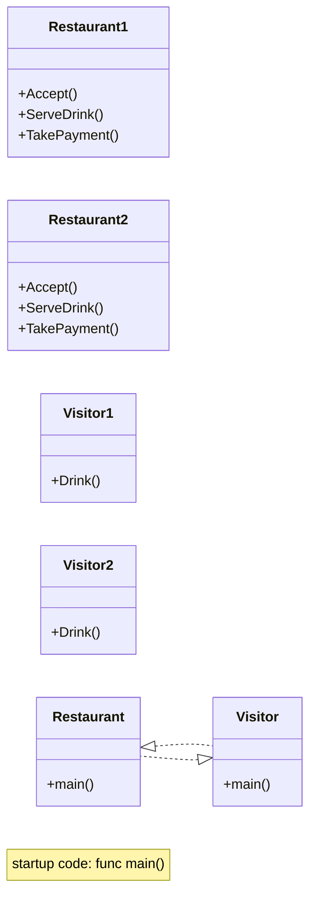

```mermaid
classDiagram
  direction LR
  class Restaurant1 {
    +Accept()
    +ServeDrink()
    +TakePayment()
  }

  class Restaurant2 {
    +Accept()
    +ServeDrink()
    +TakePayment()
  }

  class Visitor1 {
    +Drink()
  }

  class Visitor2 {
    +Drink()
  }

  class Restaurant {
    +main()
  }

  class Visitor {
    +main()
  }

  Visitor <|.. Restaurant
  Restaurant <|.. Visitor
  note "startup code: func main()"
```
