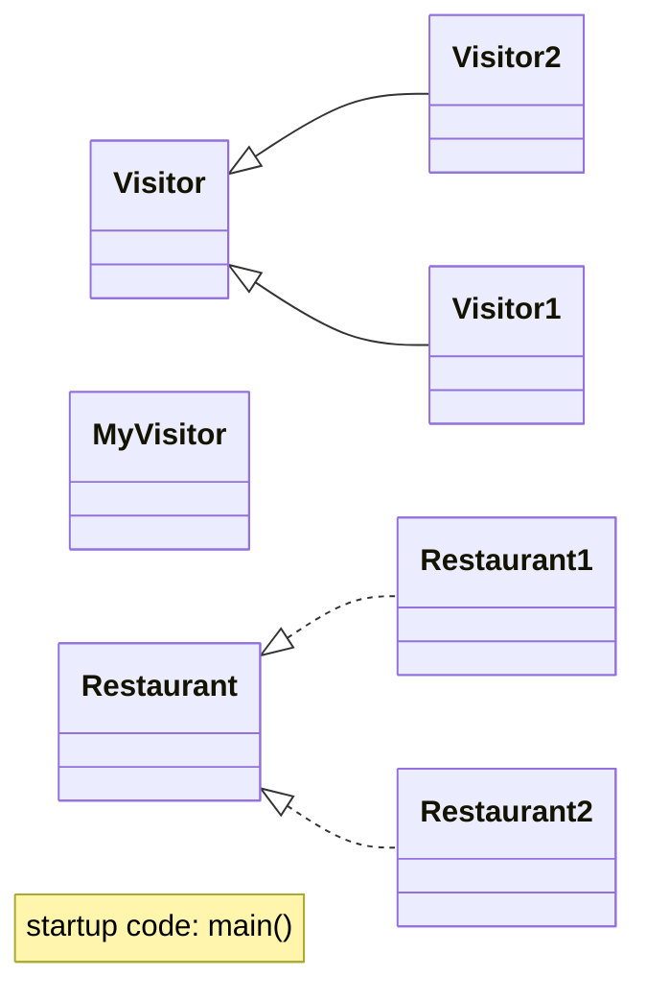

```mermaid
classDiagram
  direction LR
  class Visitor2 {
  }

  class Restaurant1 {
  }

  class Visitor {
  }

  class MyVisitor {
  }

  class Restaurant {
  }

  class Restaurant2 {
  }

  class Visitor1 {
  }

  Visitor <|-- Visitor2
  Restaurant <|.. Restaurant1
  Restaurant <|.. Restaurant2
  Visitor <|-- Visitor1
  note "startup code: main()"
```
