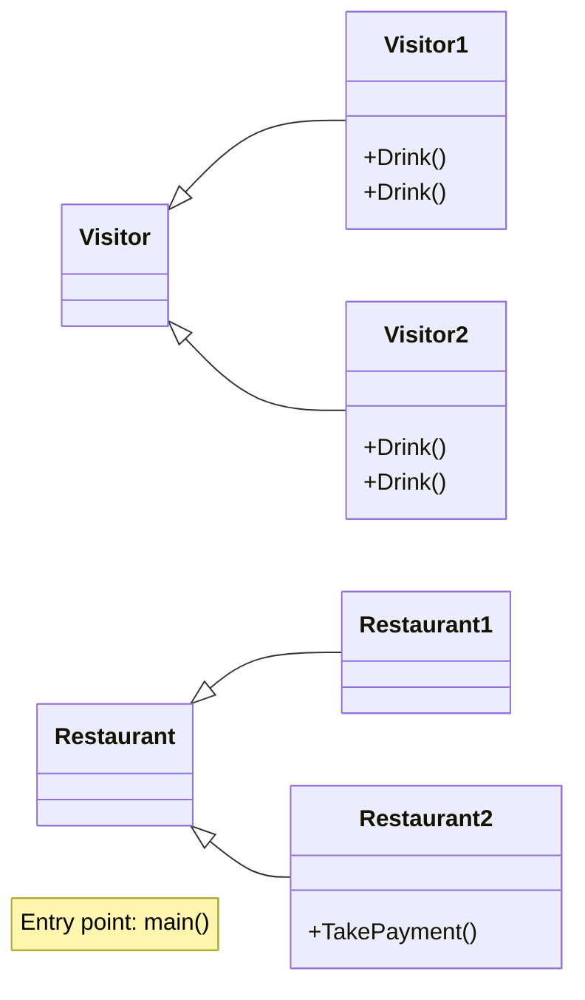

```mermaid
classDiagram
  direction LR

  class Visitor

  class Restaurant

  class Restaurant1

  class Restaurant2 {
    +TakePayment()
  }

  class Visitor1 {
    +Drink()
    +Drink()
  }

  class Visitor2 {
    +Drink()
    +Drink()
  }

  Restaurant <|-- Restaurant1

  Restaurant <|-- Restaurant2

  Visitor <|-- Visitor1

  Visitor <|-- Visitor2

  note "Entry point: main()"
```
