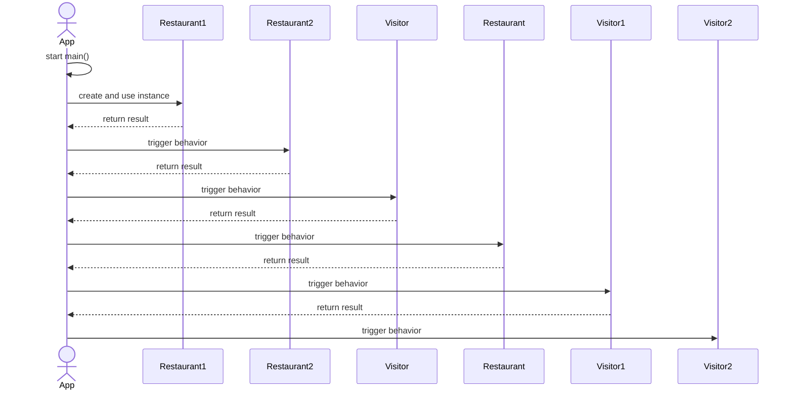

```mermaid
sequenceDiagram
  actor App
  participant Restaurant1
  participant Restaurant2
  participant Visitor
  participant Restaurant
  participant Visitor1
  participant Visitor2
  App->>App: start main()
  App->>Restaurant1: create and use instance
  Restaurant1-->>App: return result
  App->>Restaurant2: trigger behavior
  Restaurant2-->>App: return result
  App->>Visitor: trigger behavior
  Visitor-->>App: return result
  App->>Restaurant: trigger behavior
  Restaurant-->>App: return result
  App->>Visitor1: trigger behavior
  Visitor1-->>App: return result
  App->>Visitor2: trigger behavior
```
