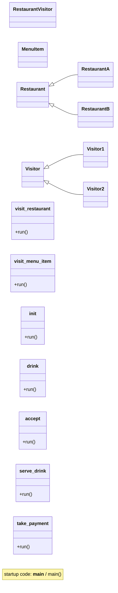

```mermaid
classDiagram
  direction LR
  class RestaurantVisitor {
  }
  class MenuItem {
  }
  class Restaurant {
  }
  class Visitor {
  }
  class Visitor1 {
  }
  class Visitor2 {
  }
  class RestaurantA {
  }
  class RestaurantB {
  }
  class visit_restaurant {
    +run()
  }
  class visit_menu_item {
    +run()
  }
  class __init__ {
    +run()
  }
  class drink {
    +run()
  }
  class accept {
    +run()
  }
  class serve_drink {
    +run()
  }
  class take_payment {
    +run()
  }
  Visitor <|-- Visitor1
  Visitor <|-- Visitor2
  Restaurant <|-- RestaurantA
  Restaurant <|-- RestaurantB
  note "startup code: __main__ / main()"
```
