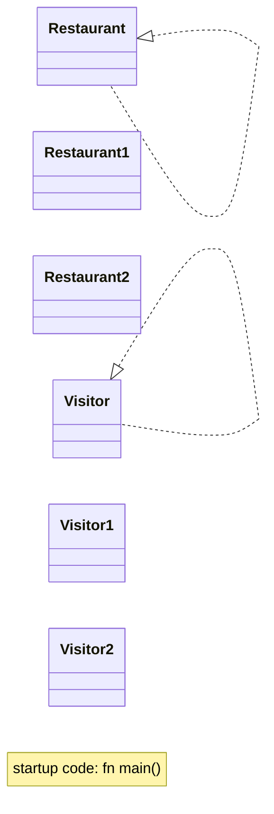

```mermaid
classDiagram
  direction LR
  class Restaurant {
  }

  class Restaurant1 {
  }

  class Restaurant2 {
  }

  class Visitor {
  }

  class Visitor1 {
  }

  class Visitor2 {
  }

  Restaurant <|.. Restaurant
  Visitor <|.. Visitor
  note "startup code: fn main()"
```
