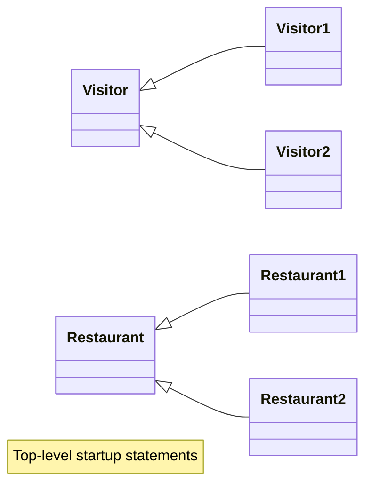

```mermaid
classDiagram
  direction LR
  class Visitor {
  }
  class Restaurant {
  }
  class Visitor1 {
  }
  class Visitor2 {
  }
  class Restaurant1 {
  }
  class Restaurant2 {
  }
  Visitor <|-- Visitor1
  Visitor <|-- Visitor2
  Restaurant <|-- Restaurant1
  Restaurant <|-- Restaurant2
  note "Top-level startup statements"
```
